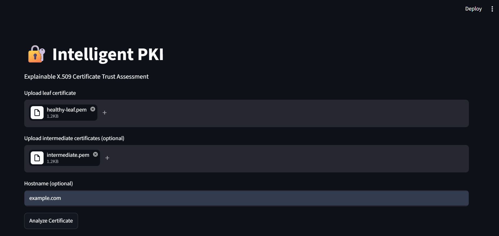
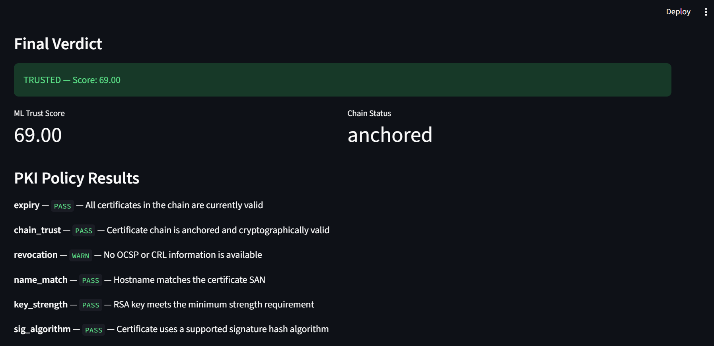
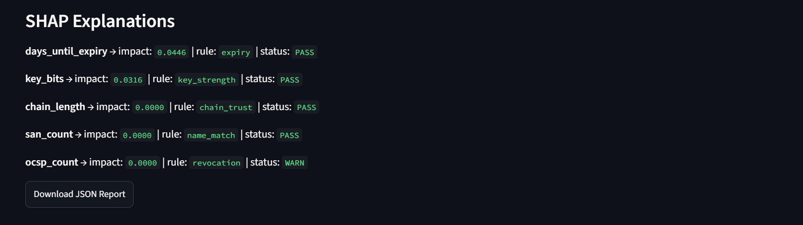
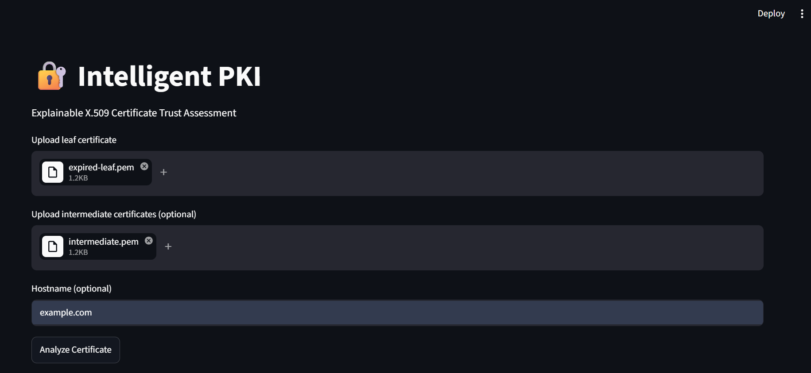
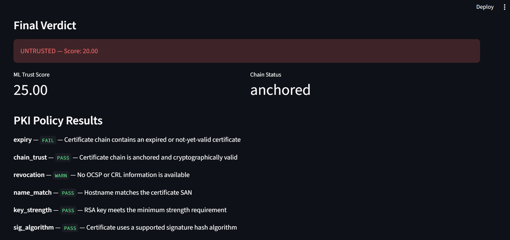
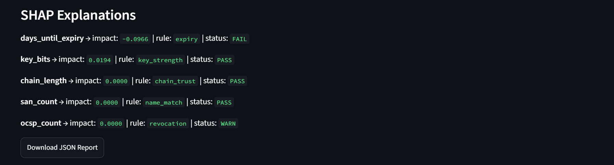

# 🔐 Intelligent PKI

### Explainable X.509 Certificate Trust Assessment

Intelligent PKI is a Python-based certificate analysis tool that combines deterministic PKI validation with machine-learning-based trust scoring to produce an explainable certificate trust assessment.

The system analyzes an X.509 certificate, builds and validates its certificate chain, evaluates configurable PKI policy rules, generates a Random Forest trust score, and combines both results into a final:

- `TRUSTED`
- `CAUTION`
- `UNTRUSTED`

The application also provides SHAP-based explanations for the machine-learning prediction and allows the final assessment to be exported as a JSON report.

---

## ✨ Features

- X.509 certificate parsing
- Certificate chain construction
- Certificate signature verification
- Certificate expiry validation
- CA constraint validation
- Key usage validation
- SAN-based hostname matching
- Signature algorithm checking
- Revocation information detection through OCSP/CRL extensions
- Configurable PKI policy evaluation
- Random Forest trust scoring
- Rule-based PKI + ML score fusion
- SHAP-based ML explanations
- Streamlit interface
- JSON report export
- Automated tests using generated certificate fixtures

---

## 🏗️ Architecture

```text
                    X.509 Certificate
                            │
                            ▼
                   Certificate Parser
                            │
                            ▼
                     Chain Builder
                            │
                            ▼
                   PKI Validator
                            │
                            ▼
                     Policy Engine
                            │
                            ├──────────────────┐
                            │                  │
                            ▼                  ▼
                     PKI Findings       ML Features
                                               │
                                               ▼
                                        Random Forest
                                               │
                                               ▼
                                         ML Trust Score
                                               │
                            ┌──────────────────┘
                            ▼
                       Fusion Engine
                            │
                            ▼
                TRUSTED / CAUTION / UNTRUSTED
                            │
                            ▼
                     SHAP Explanations
                            │
                            ▼
                   Streamlit + JSON Report
'''
## Demo

### Trusted Certificate



### PKI Policy Results



### SHAP Explanation



### Untrusted Certificate



### Untrusted PKI Policy



### Untrusted SHAP Explanation


